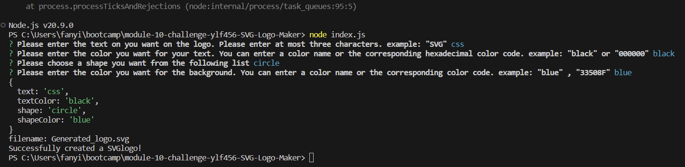
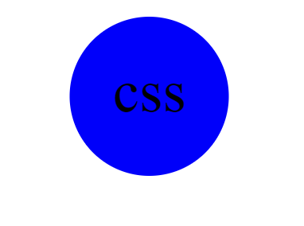

# SVG Logo Maker

## Description

This Scalable Vector Graphics (SVG) generator, written using JavaScript and Node.js, was created by Yilun Fan for study purposes

## Installation

Javascript, node.js and node package.

## Usage

To use this application, change the directory path to the root folder and install the Node.js package first by typing npm i in the terminal. Then, type node index.js in the terminal, and follow the instructions in the prompt to generate an SVG log (.svg file).

## Credits

N/A

## License

N/A

## Link to this application

Link to the DEMO video: 

Link to this Repo: https://github.com/ylf456/module-10-challenge-ylf456-README-generator.git

Link to deployed APP: n/a

## Screenshots

